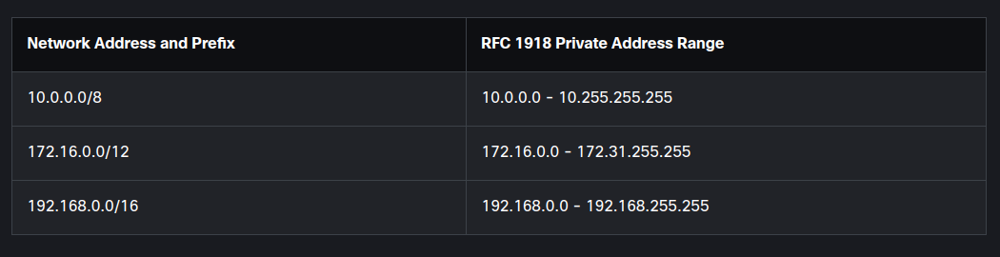

## Network types
The internet is not owned by any individual or group. The internet is a worldwide collection of interconnected networks (internetwork or internet for short), cooperating with each other to exchange information using common standards. Through telephone wires, fiber-optic cables, wireless transmissions, and satellite links, internet users can exchange information in a variety of forms.
Small home networks connect a few computers to each other and to the internet. The SOHO network allows computers in a home office or a remote office to connect to a corporate network, or access centralized, shared resources. Medium to large networks, such as those used by corporations and schools, can have many locations with hundreds or thousands of interconnected hosts. The internet is a network of networks that connects hundreds of millions of computers world-wide.
There are devices all around that you may interact with on a daily basis that are also connected to the internet. These include mobile devices such as smartphones, tablets, smartwatches, and smart glasses. Things in your home can be connected to the internet such as a security system, appliances, your smart TV, and your gaming console. Outside your home there are smart cars, RFID tags, sensors and actuators, and even medical devices which can be connected.

## Data transmition
The following categories are used to classify types of personal data:

Volunteered data - This is created and explicitly shared by individuals, such as social network profiles. This type of data might include video files, pictures, text, or audio files.
Observed data - This is captured by recording the actions of individuals, such as location data when using cell phones.
Inferred data - This is data such as a credit score, which is based on analysis of volunteered or observed data.
The term bit is an abbreviation of “binary digit” and represents the smallest piece of data. Each bit can only have one of two possible values, 0 or 1.
There are three common methods of signal transmission used in networks:
* Electrical signals - Transmission is achieved by representing data as electrical pulses on copper wire.
* Optical signals - Transmission is achieved by converting the electrical signals into light pulses.
* Wireless signals - Transmission is achieved by using infrared, microwave, or radio waves through the air.

## Bandwidth and Throughput
Bandwidth is the capacity of a medium to carry data. Digital bandwidth measures the amount of data that can flow from one place to another in a given amount of time. Bandwidth is typically measured in the number of bits that (theoretically) can be sent across the media in a second. Common bandwidth measurements are as follows:

* Thousands of bits per second (Kbps)
* Millions of bits per second (Mbps)
* Billions of bits per second (Gbps)

Throughput does not usually match the specified bandwidth. Many factors influence throughput including:

* The amount of data being sent and received over the connection
* The latency created by the number of network devices encountered between source and destination.
  
Latency refers to the amount of time, including delays, for data to travel from one given point to another.

## ISP
An Internet Service Provider (ISP) provides the link between the home network and the internet. An ISP can be the local cable provider, a landline telephone service provider, the cellular network that provides your smartphone service, or an independent provider who leases bandwidth on the physical network infrastructure of another company.

## Clients and Servers
All computers connected to a network that participate directly in network communication are classified as hosts. Hosts can send and receive messages on the network. In modern networks, computer hosts can act as a client, a server, or both. The software installed on the computer determines which role the computer plays.

Client and server software usually run on separate computers, but it is also possible for one computer to run both client and server software at the same time. In small businesses and homes, many computers function as the servers and clients on the network. This type of network is called a P2P network. In larger businesses, because of the potential for high amounts of network traffic, it is often necessary to have dedicated servers to support the number of service requests. P2P networks are easy to set up, less complex, lower in cost, and can be used for simple tasks such as transferring files and sharing printers. However, there is no centralized administration. They have less security, are not scalable, and can perform slower.

## Network Componets
There are symbols that represent various types of networking equipment. The network infrastructure is the platform that supports the network. It provides the stable and reliable channel over which our communications can occur. The network infrastructure contains three categories of hardware components: end devices, intermediate devices, and network media. Hardware is often the visible components of the network platform such as a laptop, PC, switch, router, wireless access point, or the cabling used to connect the devices. Components that are not visible include wireless media.
End devices, or hosts, form the interface between users and the underlying communication network. Some examples of end devices include:

* Computers (workstations, laptops, file servers, web servers)
* Network printers
* Telephones and teleconferencing equipment
* Security cameras
* Mobile devices (such as smartphones, tablets, PDAs, and wireless debit/credit card readers and barcode scanners)

## ISP Connectivity Options 
An ISP provides the link between the home network and the internet. An ISP can be the local cable provider, a landline telephone service provider, the cellular network that provides your smartphone service, or an independent provider who leases bandwidth on the physical network infrastructure of another company. Each ISP connects to other ISPs to form a network of links that interconnect users all over the world. ISPs are connected in a hierarchical manner that ensures that internet traffic generally takes the shortest path from the source to the destination.

The interconnection of ISPs that forms the backbone of the internet is a complex web of fiber-optic cables with expensive networking switches and routers that direct the flow of information between source and destination hosts.

For a home user, connecting to the ISP is a fairly uncomplicated process. This is the most common connection option. It consists of using a wireless integrated router to connect to the ISP. The router includes a switch to connect wired hosts and a wireless AP to connect wireless hosts. The router also provides client IP addressing information and security for inside hosts. The two most common methods are cable and DSL. Other options include cellular, satellite, and dial-up telephone.

## Home Network Basics
Most home networks consist of at least two separate networks. The public network coming in from the service provider. The router is connected to the internet. Most likely, the home router is equipped with both wired and wireless capabilities. A home network is a small LAN with devices that usually connect to an integrated router and to each other in order to exchange information.

Wireless technology is fairly easy and inexpensive to install. Advantages of wireless LAN technology include mobility, scalability, flexibility, cost savings, reduced installation time, and reliability in harsh environments.

In addition to an integrated router, there are many different types of devices that might be connecting to a home network, Examples include desktop computers, gaming systems, smart tv systems, printers, scanners, security cameras, and climate control devices.

Small business and home routers typically have two primary types of ports: ethernet ports and internet ports. In addition to the wired ports, many home routers include a radio antenna and a built-in wireless access point.

## Network Technologies in the Home
Wireless technologies use electromagnetic waves to carry information between devices. The electromagnetic spectrum includes such things as radio and television broadcast bands, visible light, x-rays, and gamma-rays. Some types of electromagnetic waves are not suitable for carrying data. Other parts of the spectrum are regulated by governments and licensed to various organizations for specific applications.

Certain unlicensed sections of the spectrum are incorporated into consumer products, including the Wi-Fi routers found in most homes. The wireless technologies most frequently used in home networks are in the unlicensed 2.4 GHz and 5 GHz frequency ranges. Bluetooth is a technology that makes use of the 2.4 GHz band. Other technologies that use the 2.4 GHz and 5 GHz bands are the modern wireless LAN technologies that conform to the various IEEE 802.11 standards. Unlike Bluetooth technology, 802.11 devices transmit at a much higher power level giving them a great range and improved throughput.

Although many home network devices support wireless communications, there are still a few applications where devices benefit from a wired switch connection. The most commonly implemented wired protocol is the Ethernet protocol. Directly connected devices use an Ethernet patch cable, usually unshielded twisted pair. Category 5e is the most common wiring used in a LAN. The cable is made up of 4 pairs of wires that are twisted to reduce electrical interference. For those homes that do not have UTP wiring, there are other technologies, such as powerline, that can distribute wired connectivity throughout the premises.

## Wireless standards
The IEEE 802.11 standard governs the WLAN environment. Wireless standards for LANs use the 2.4 GHz and 5 GHz frequency bands. Collectively these technologies are referred to as Wi-Fi. The Wi-Fi Alliance is responsible for testing wireless LAN devices from different manufacturers.

Wireless routers using the 802.11 standards have multiple settings that have to be configured. These settings include the following:

Network mode - Determines the type of technology that must be supported. For example, 802.11b, 802.11g, 802.11n or Mixed Mode.
Network Name (SSID) - Used to identify the WLAN. All devices that wish to participate in the WLAN must have the same SSID.
Standard Channel - Specifies the channel over which communication will occur. By default, this is set to Auto to allow the access point (AP) to determine the optimum channel to use.
SSID Broadcast - Determines if the SSID will be broadcast to all devices within range. By default, set to Enabled.
The 802.11 protocol can provide increased throughput based on the wireless network environment. If all wireless devices connect with the same 802.11 standard, maximum speeds can be obtained for that standard. If the access point is configured to accept only one 802.11 standard, devices that do not use that standard cannot connect to the access point. A mixed mode wireless network environment can include devices that use any of the existing Wi-Fi standards.

When building a wireless network, it is important that the wireless components connect to the appropriate WLAN. This is done using the SSID. The SSID is used to tell wireless devices, called STAs, which WLAN they belong to and with which other devices they can communicate. The SSID broadcast allows other devices and wireless clients to automatically discover the name of the wireless network. When the SSID broadcast is disabled, you must manually enter the SSID on wireless devices.

## Communication Protocol

Protocols are required for computers to properly communicate across the network. These include message format, message size, timing, encoding, encapsulation, and message patterns.

* Message format - When a message is sent, it must use a specific format or structure.
* Message size - The rules that govern the size of the pieces communicated across the network are very strict. They can also be different, depending on the channel used.
* Timing - Timing determines the speed at which the bits are transmitted across the network. It also affects when an individual host can send data and the total amount of data that can be sent in any one transmission.
* Encoding - Messages sent across the network are first converted into bits by the sending host. Each bit is encoded into a pattern of sounds, light waves, or electrical impulses depending on the network media over which the bits are transmitted.
* Encapsulation - Each message transmitted on a network must include a header that contains addressing information that identifies the source and destination hosts. Encapsulation is the process of adding this information to the pieces of data that make up the message.
* Message pattern - Some messages require an acknowledgment before the next message can be sent. This type of request/response pattern is a common aspect of many networking protocols. However, there are other types of messages that may be simply streamed across the network, without concern as to whether they reach their destination.

## Communication standards
Topologies allow us to see the networking using representation of end devices and intermediary devices. How does a device see a network? Think of a device in a bubble. The only thing a device sees is its own addressing information. How does the device know it is on the same network as another device? The answer is network protocols. Most network communications are broken up into smaller data units, or packets.

A standard is a set of rules that determines how something must be done. Networking and internet standards ensure that all devices connecting to the network implement the same set of rules or protocols in the same manner. Using standards, it is possible for different types of devices to send information to each other over the internet.

An internet standard is the end result of a comprehensive cycle of discussion, problem solving, and testing. These different standards are developed, published, and maintained by a variety of organizations. When a new standard is proposed, each stage of the development and approval process is recorded in a numbered RFC document so that the evolution of the standard is tracked. RFCs for internet standards are published and managed by the IETF.

## Network comminication models
Protocols are the rules that govern communications. Successful communication between hosts requires interaction between a number of protocols. Protocols include HTTP, TCP, IP, and Ethernet. These protocols are implemented in software and hardware that are installed on each host and networking device.

The interaction between the different protocols on a device can be illustrated as a protocol stack. A stack illustrates the protocols as a layered hierarchy, with each higher-level protocol depending on the services of the protocols shown in the lower levels. The separation of functions enables each layer in the stack to operate independently of others.

The suite of TCP/IP protocols that are used for internet communications follows the structure of this model:

* Application - Represents data to the user, plus encoding and dialog control
* Transport -Supports communication between various devices across diverse networks
* Internet - Determines the best path through the network
* Network Access - The hardware devices and media that make up the network.

A reference model describes the functions that must be completed at a particular layer but does not specify exactly how a function should be accomplished. The primary purpose of a reference model is to aid in clearer understanding of the functions and processes necessary for network communications.

The most widely known internetwork reference model was created by the OSI project at the International ISO. It is used for data network design, operation specifications, and troubleshooting. This model is commonly referred to as the OSI model.

## OSI model layer description
7 – Application - The application layer contains protocols used for process-to-process communications.
6 – Presentation - The presentation layer provides for common representation of the data transferred between application layer services.
5 – Session - The session layer provides services to the presentation layer to organize its dialogue and to manage data exchange.
4 – Transport - The transport layer defines services to segment, transfer, and reassemble the data for individual communications between the end devices.
3 – Network - The network layer provides services to exchange the individual pieces of data over the network between identified end devices.
2 - Data Link - The data link layer protocols describe methods for exchanging data frames between devices over a common media
1 – Physical - The physical layer protocols describe the mechanical, electrical, functional, and procedural means to activate, maintain, and de-activate physical connections for a bit transmission to and from a network device.

## Encapsulation and the Ethernet Frame
The process of placing one message format inside another message format is called encapsulation. De-encapsulation occurs when the process is reversed by the recipient and the letter is removed from the envelope. Just as a letter is encapsulated in an envelope for delivery, so computer messages are encapsulated. A message that is sent over a computer network follows specific format rules for it to be delivered and processed.

The Ethernet protocol standards define many aspects of network communication including frame format, frame size, timing, and encoding. The format for Ethernet frames specifies the location of the destination and source MAC addresses, and additional information including preamble for sequencing and timing, start of frame delimiter, length and type of frame, and frame check sequence to detect transmission errors.

## The access layer
The access layer is the part of the network in which people gain access to other hosts and to shared files and printers. The access layer provides the first line of networking devices that connect hosts to the wired Ethernet network. Within an Ethernet network, each host can connect directly to an access layer networking device using an Ethernet cable. Ethernet hubs contain multiple ports that are used to connect hosts to the network. Only one message can be sent through an Ethernet hub at a time. Two or more messages sent at the same time will cause a collision. Because excessive retransmissions can clog up the network and slow down network traffic, hubs are now considered obsolete and have been replaced by Ethernet switches.

An Ethernet switch is a device that is used at Layer 2. When a host sends a message to another host connected to the same switched network, the switch accepts and decodes the frames to read the MAC address portion of the message. A table on the switch, called a MAC address table, contains a list of all the active ports and the host MAC addresses that are attached to them. When a message is sent between hosts, the switch checks to see if the destination MAC address is in the table. If it is, the switch builds a temporary connection, called a circuit, between the source and destination ports. Ethernet switches also allow for sending and receiving frames over the same Ethernet cable simultaneously. This improves the performance of the network by eliminating collisions.

A switch builds the MAC address table by examining the source MAC address of each frame that is sent between hosts. When a new host sends a message or responds to a flooded message, the switch immediately learns its MAC address and the port to which it is connected. The table is dynamically updated each time a new source MAC address is read by the switch.

## IPv4
The IPv4 address is a logical network address that identifies a particular host. It must be properly configured and unique within the LAN, for local communication. It must also be properly configured and unique in the world, for remote communication.

An IPv4 address is assigned to the network interface connection for a host. This connection is usually a NIC installed in the device.

Every packet sent across the internet has a source and destination IPv4 address. This information is required by networking devices to ensure the information gets to the destination and any replies are returned to the source.

## IPv4 structure
The logical 32-bit IPv4 address is hierarchical and is made up of two parts, the network, and the host. As an example, there is a host with an IPv4 address 192.168.5.11 with a subnet mask of 255.255.255.0. The first three octets, (192.168.5), identify the network portion of the address, and the last octet, (11) identifies the host. This is known as hierarchical addressing because the network portion indicates the network on which each unique host address is located.

Routers only need to know how to reach each network, rather than needing to know the location of each individual host. With IPv4 addressing, multiple logical networks can exist on one physical network if the network portion of the logical network host addresses is different.

## IPv4 Unicast Broadcast and Milticast
Unicast transmission refers to one device sending a message to one other device in one-to-one communications. A unicast packet has a destination IP address that is a unicast address which goes to a single recipient. A source IP address can only be a unicast address because the packet can only originate from a single source. This is regardless of whether the destination IP address is a unicast, broadcast or multicast. IPv4 unicast host addresses are in the address range of 1.1.1.1 to 223.255.255.255.

Broadcast transmission refers to a device sending a message to all the devices on a network in one-to-all communications. A broadcast packet has a destination IP address with all ones (1s) in the host portion, or 32 one (1) bits. A broadcast packet must be processed by all devices in the same broadcast domain. A broadcast may be directed or limited. A directed broadcast is sent to all hosts on a specific network. A limited broadcast is sent to 255.255.255.255. By default, routers do not forward broadcasts.

Multicast transmission reduces traffic by allowing a host to send a single packet to a selected set of hosts that subscribe to a multicast group. A multicast packet is a packet with a destination IP address that is a multicast address. IPv4 has reserved the 224.0.0.0 to 239.255.255.255 addresses as a multicast range. Each multicast group is represented by a single IPv4 multicast destination address. When an IPv4 host subscribes to a multicast group, the host processes packets addressed to this multicast address, and packets addressed to its uniquely allocated unicast address.

## Types of IPv4 Addresses
Public IPv4 addresses are addresses which are globally routed between ISP routers. However, not all available IPv4 addresses can be used on the internet. There are blocks of addresses called private addresses that are used by most organizations to assign IPv4 addresses to internal hosts. Most internal networks, from large enterprises to home networks, use private IPv4 addresses for addressing all internal devices (intranet) including hosts and routers. However, private addresses are not globally routable. Before the ISP can forward this packet, it must translate the source IPv4 address, which is a private address, to a public IPv4 address using NAT.

Loopback addresses (127.0.0.0 /8 or 127.0.0.1 to 127.255.255.254) are more commonly identified as only 127.0.0.1, these are special addresses used by a host to direct traffic to itself. Link-local addresses (169.254.0.0 /16 or 169.254.0.1 to 169.254.255.254) are more commonly known as the Automatic Private IP Addressing (APIPA) addresses or self-assigned addresses. They are used by a Windows DHCP client to self-configure in the event that there are no DHCP servers available.

In 1981, IPv4 addresses were assigned using classful addressing as defined in RFC 790 (https://tools.ietf.org/html/rfc790), Assigned Numbers. Customers were allocated a network address based on one of three classes, A, B, or C. The RFC divided the unicast ranges into specific classes as follows:

Class A (0.0.0.0/8 to 127.0.0.0/8) - Designed to support extremely large networks with more than 16 million host addresses.
Class B (128.0.0.0 /16 - 191.255.0.0 /16) - Designed to support the needs of moderate to large size networks with up to approximately 65,000 host addresses.
Class C (192.0.0.0 /24 - 223.255.255.0 /24) - Designed to support small networks with a maximum of 254 hosts.
There is also a Class D multicast block consisting of 224.0.0.0 to 239.0.0.0 and a Class E experimental address block consisting of 240.0.0.0 - 255.0.0.0.

Public IPv4 addresses are addresses which are globally routed over the internet. Public IPv4 addresses must be unique. Both IPv4 and IPv6 addresses are managed by the IANA. The IANA manages and allocates blocks of IP addresses to the RIRs. RIRs are responsible for allocating IP addresses to ISPs who provide IPv4 address blocks to organizations and smaller ISPs. Organizations can also get their addresses directly from an RIR.

## Network Segmentation

In an Ethernet LAN, devices use broadcasts and ARP to locate other devices. ARP sends Layer 2 broadcasts to a known IPv4 address on the local network to discover the associated MAC address. Devices on Ethernet LANs also locate other devices using services. A host typically acquires its IPv4 address configuration using DHCP which sends broadcasts on the local network to locate a DHCP server. Switches propagate broadcasts out all interfaces except the interface on which it was received.

A large broadcast domain is a network that connects many hosts. A problem with a large broadcast domain is that these hosts can generate excessive broadcasts and negatively affect the network. The solution is to reduce the size of the network to create smaller broadcast domains in a process called subnetting. These smaller network spaces are called subnets. The basis of subnetting is to use host bits to create additional subnets. Subnetting reduces overall network traffic and improves network performance. It helps administrators to implement security policies such as which subnets are allowed or not allowed to communicate together. It reduces the number of devices affected by abnormal broadcast traffic due to misconfigurations, hardware/software problems, or malicious intent.

## IPv4 Issues
The depletion of IPv4 address space has been the motivating factor for moving to IPv6. IPv6 has a larger 128-bit address space, providing 340 undecillion possible addresses. When the IETF began its development of a successor to IPv4, it used this opportunity to fix the limitations of IPv4 and include enhancements. One example is ICMPv6, which includes address resolution and address autoconfiguration not found in ICMPv4.

Both IPv4 and IPv6 coexist and the transition to only IPv6 will take several years. The IETF has created various protocols and tools to help network administrators migrate their networks to IPv6. The migration techniques can be divided into three categories: Dual Stack, Tunneling, and Translation. Dual stack devices run both IPv4 and IPv6 protocol stacks simultaneously. Tunneling is a method of transporting an IPv6 packet over an IPv4 network. The IPv6 packet is encapsulated inside an IPv4 packet, similar to other types of data. NAT64 allows IPv6-enabled devices to communicate with IPv4-enabled devices using a translation technique similar to NAT for IPv4. An IPv6 packet is translated to an IPv4 packet and an IPv4 packet is translated to an IPv6 packet.

## IPv6 Addressing
IPv6 addresses are 128 bits in length and written as a string of hexadecimal values. Every four bits is represented by a single hexadecimal digit; for a total of 32 hexadecimal values. IPv6 addresses are not case-sensitive and can be written in either lowercase or uppercase. In IPv6, a hextet that refers to a segment of 16 bits, or four hexadecimal values. Each “x” is a single hextet, which is 16 bits or four hexadecimal digits. Preferred format means that you write IPv6 address using all 32 hexadecimal digits. Here is one example - fe80:0000:0000:0000:0123:4567:89ab:cdef.
There are two rules that help to reduce the number of digits needed to represent an IPv6 address.

Rule 1 – Omit Leading Zeros. You can only omit leading zeros, not trailing zeros.

01ab can be represented as 1ab
09f0 can be represented as 9f0
0a00 can be represented as a00
00ab can be represented as ab
Rule 2 – Double Colon. A double colon (::) can replace any single, contiguous string of one or more 16-bit hextets consisting of all zeros. For example, 2001:db8:cafe:1:0:0:0:1 (leading 0s omitted) could be represented as 2001:db8:cafe:1::1. The double colon (::) is used in place of the three all-0 hextets (0:0:0). The double colon (::) can only be used once within an address, otherwise there would be more than one possible resulting address. If an address has more than one contiguous string of all-0 hextets, best practice is to use the double colon (::) on the longest string. If the strings are equal, the first string should use the double colon (::).

## Static and Dynamic Addresing
With a static assignment, the network administrator must manually configure the network information for a host. At a minimum, this includes the host IPv4 address, subnet mask, and default gateway. Static assignment of addressing information can provide increased control of network resources, but it can be time consuming to enter the information on each host. When using static IPv4 addressing, it is important to maintain an accurate list of which IPv4 addresses are assigned to which devices.

IPv4 addresses can be assigned automatically using a protocol known as DHCP. DHCP is generally the preferred method of assigning IPv4 addresses to hosts on large networks because it reduces the burden on network support staff and virtually eliminates entry errors. Another benefit of DHCP is that an address is not permanently assigned to a host but is only leased for a period of time. If the host is powered down or taken off the network, the address is returned to the pool for reuse.

As you enter area with a wireless hotspot, your laptop DHCP client contacts the local DHCP server via a wireless connection. The DHCP server assigns an IPv4 address to your laptop. With home networks, the DHCP server may be located at the ISP and a host on the home network receives its IPv4 configuration directly from the ISP. Many home networks and small businesses use a wireless router and modem. In this case, the wireless router is both a DHCP client and a server.

## DHCPv4 Configuration

The DHCP server is configured with a range, or pool, of IPv4 addresses that can be assigned to DHCP clients. A client that needs an IPv4 address will send a DHCP Discover message which is a broadcast with a destination IPv4 address of 255.255.255.255 (32 ones) and a destination MAC address of FF-FF-FF-FF-FF-FF (48 ones). All hosts on the network will receive this broadcast DHCP frame, but only a DHCP server will reply. The server will respond with a DHCP Offer, suggesting an IPv4 address for the client. The host then sends a DHCP Request asking to use the suggested IPv4 address. The server responds with a DHCP Acknowledgment.

For most home and small business networks, a wireless router provides DHCP services to the local network clients. To configure a home wireless router, access its graphical web interface by opening the browser and entering the router default IPv4 address. The IPv4 address of 192.168.0.1 and subnet mask of 255.255.255.0 are the defaults for the internal router interface. This is the default gateway for all hosts on the local network and also the internal DHCP server IPv4 address. Most home wireless routers have DHCP Server enabled by default.

## NAT Operations
The wireless router receives a public address from the ISP, which allows it to send and receive packets on the internet. It, in turn, provides private addresses to local network clients.

The process used to convert private addresses to internet-routable addresses is called NAT. With NAT, a private (local) source IPv4 address is translated to a public (global) address. The process is reversed for incoming packets. The wireless router is able to translate many internal IPv4 addresses to the same public address, by using NAT.

Only packets destined for other networks need to be translated. These packets must pass through the gateway, where the wireless router replaces the private IPv4 address of the source host with its own public IPv4 address.

## MAC and IP
Sometimes a host must send a message, but it only knows the IP address of the destination device. The host needs to know the MAC address of that device. The MAC address can be discovered using address resolution. There are two primary addresses assigned to a device on an Ethernet LAN:

Physical address (the MAC address) – Used for NIC-to-NIC communications on the same Ethernet network.
Logical address (the IP address) – Used to send the packet from the source device to the destination device. The destination IP address may be on the same IP network as the source, or it may be on a remote network.
When the destination IP address (IPv4 or IPv6) is on a remote network, the destination MAC address will be the address of the host default gateway (i.e., the router interface). Routers examine the destination IPv4 address to determine the best path to forward the IPv4 packet. When the router receives the Ethernet frame, it de-encapsulates the Layer 2 information. Using the destination IPv4 address, it determines the next-hop device, and then encapsulates the IPv4 packet in a new data link frame for the outgoing interface. Along each link in a path, an IP packet is encapsulated in a frame. The frame is specific to the data link technology that is associated with that link, such as Ethernet. If the next-hop device is the final destination, the destination MAC address will be that of the device Ethernet NIC.

## Brotcast containment
A message can only contain one destination MAC address. Address resolution lets a host send a broadcast message to a unique MAC address that is recognized by all hosts. The broadcast MAC address is a 48-bit address made up of all ones. MAC addresses are usually represented in hexadecimal notation. The broadcast MAC address in hexadecimal notation is FFFF.FFFF.FFFF. Each F in the hexadecimal notation represents four ones in the binary address.

When a host sends a broadcast message, switches forward the message to every connected host within the same local network. For this reason, a local area network, a network with one or more Ethernet switches, is also referred to as a broadcast domain.

If too many hosts are connected to the same broadcast domain, broadcast traffic can become excessive. The number of hosts and the amount of network traffic that can be supported on the local network is limited by the capabilities of the switches used to connect them. To improve performance, you may need to divide one local network into multiple networks, or broadcast domains. Routers are used to divide the network into multiple broadcast domains.

On a local Ethernet network, a NIC only accepts a frame if the destination address is either the broadcast MAC address, or else corresponds to the MAC address of the NIC. Most network applications rely on the logical destination IP address to identify the location of the servers and clients. How does the sending host determine what destination MAC address to place within the frame? The sending host can ARP to discover the MAC address of any host on the same local network.

ARP uses a three-step process to discover and store the MAC address of a host on the local network when only the IPv4 address of the host is known:

The sending host creates and sends a frame addressed to a broadcast MAC address. Contained in the frame is a message with the IPv4 address of the intended destination host.
Each host on the network receives the broadcast frame and compares the IPv4 address inside the message with its configured IPv4 address. The host with the matching IPv4 address sends its MAC address back to the original sending host.
The sending host receives the message and stores the MAC address and IPv4 address information in a table called an ARP table.
IPv6 uses a similar method known as Neighbor Discovery.

## The need for routing 
As networks grow, it is often necessary to divide one access layer network into multiple access layer networks. There are many ways to divide networks based on different criteria:

Broadcast containment - Routers in the distribution layer can limit broadcasts to the local network where they need to be heard.
Security requirements - Routers in the distribution layer can separate and protect certain groups of computers where confidential information resides.
Physical locations - Routers in the distribution layer can be used to interconnect local networks at various locations of an organization that are geographically separated.
Logical grouping - Routers in the distribution layer can be used to logically group users, such as departments within a company, who have common needs or for access to resources.
The distribution layer connects these independent local networks and controls the traffic flowing between them. It is responsible for ensuring that traffic between hosts on the local network stays local.

A router is a networking device that connects multiple Layer 3, IP networks. At the distribution layer of the network, routers direct traffic and perform other functions critical to efficient network operation. Routers, like switches, are able to decode and read the messages that are sent to them. Unlike switches, which make their forwarding decision based on the Layer 2 MAC address, routers make their forwarding decision based on the Layer 3 IP address.

Anytime the network portion of the IP addresses of the source and destination hosts do not match, a router must be used to forward the message.

## The routing table
Each port, or interface, on a router connects to a different local network. Every router contains a table of all locally connected networks and the interfaces that connect to them.

When a router receives a frame, it decodes the frame to get to the packet containing the destination IP address. It matches the network portion of the destination IP address to the networks that are listed in the routing table. If the destination network address is in the table, the router encapsulates the packet in a new frame in order to send it out. It forwards the new frame out of the interface associated with the path, to the destination network. The process of forwarding the packets toward their destination network is called routing.

A router forwards a packet to one of two places: a directly connected network containing the actual destination host, or to another router on the path to reach the destination host. When a router encapsulates the frame to forward it out a routed interface, it must include a destination MAC address. If the router must forward the packet to another router through a routed interface, it will use the MAC address of the connected router. Routers obtain these MAC addresses from ARP tables.

A host is given the IPv4 address of the router through the default gateway address configured in its TCP/IP settings. The default gateway address is the address of the router interface connected to the same local network as the source host. All hosts on the local network use the default gateway address to send messages to the router.

Routing tables contain the addresses of networks, and the best path to reach those networks. Entries can be made to the routing table in two ways: dynamically updated by information received from other routers in the network, or manually entered by a network administrator.

## LAN
LAN refers to a local network, or a group of interconnected local networks that are under the same administrative control. All the local networks within a LAN are under one administrative control. Other common characteristics of LANs are that they typically use Ethernet or wireless protocols, and they support high data rates.

Within a LAN, it is possible to place all hosts on a single local network or divide them up between multiple networks connected by a distribution layer device.

Placing all hosts on a single local network allows them to be seen by all other hosts. This is because there is one broadcast domain and hosts use ARP to find each other.

Placing additional hosts on a remote network will decrease the impact of traffic demands. However, hosts on one network will not be able to communicate with hosts on the other network without the use of routing. Routers increase the complexity of the network configuration and can introduce latency, or time delay, on packets sent from one local network to the other.

## TCP and UDP
UDP is a 'best effort' delivery system that does not require acknowledgment of receipt. UDP is preferable with applications such as streaming audio and VoIP. Acknowledgments would slow down delivery and retransmissions are undesirable. Packets take a path from the source to a destination. A few packets may be lost but it is usually not noticeable.

TCP packets take a path from the source to the destination. However, each of the packets has a sequence number. TCP breaks up a message into small pieces known as segments. The segments are numbered in sequence and passed to the IP process for assembly into packets. TCP keeps track of the number of segments that have been sent to a specific host from a specific application. If the sender does not receive an acknowledgment within a certain period of time, it assumes that the segments were lost and retransmits them. Only the portion of the message that is lost is resent, not the entire message.

## Port Numbers

When a message is delivered using either TCP or UDP, the protocols and services requested are identified by a port number. A port is a numeric identifier within each segment that is used to keep track of specific conversations between a client and server. Every message that a host sends contains both a source and destination port.

When a message is received by a server, it is necessary for the server to be able to determine which service is being requested by the client. Clients are preconfigured to use a destination port that is registered on the internet for each service.

Ports are assigned and managed by an organization known as the ICANN. Ports are broken into three categories and range in number from 1 to 65,535:

Well-Known Ports - Destination ports that are associated with common network applications are identified as well-known ports. These ports are in the range of 1 to 1023.
Registered Ports - Ports 1024 through 49151 can be used as either source or destination ports. These can be used by organizations to register specific applications such as IM applications.
Private Ports - Ports 49152 through 65535 are often used as source ports. These ports can be used by any application.
The source port number is dynamically generated by the sending device to identify a conversation between two devices. This process allows multiple conversations to occur simultaneously. It is common for a device to send multiple HTTP service requests to a web server at the same time. Each separate HTTP conversation is tracked based on the source ports.

The client places a destination port number in the segment to tell the destination server what service is being requested. A server can offer more than one service simultaneously, such as web services on port 80 at the same time that it offers FTP connection establishment on port 21.

Unexplained TCP connections can pose a major security threat. They can indicate that something or someone is connected to the local host. Sometimes it is necessary to know which active TCP connections are open and running on a networked host. Netstat is an important network utility that can be used to verify those connections. The command netstat is used to list the protocols in use, the local address and port numbers, the foreign address and port numbers, and the connection state.

## email and Messaging
Each mail server receives and stores mail for users who have mailboxes configured on the mail server. Each user with a mailbox must then use an email client to access the mail server and read these messages. Many internet messaging systems use a web-based client to access email including Microsoft 365, Yahoo, and Gmail. Application protocols used in processing email include SMTP, POP3, and IMAP4.

SMTP is used by an email client to send messages to its local email server. The local server then decides if the message is destined for a local mailbox or if the message is addressed to a mailbox on another server. If the server must send the message to a different server, SMTP is used between those two servers. SMTP requests are sent to port 25. A server that supports POP clients receives and stores messages addressed to its users. When the client connects to the email server, the messages are downloaded to the client. By default, messages are not kept on the server after they have been accessed by the client. Clients contact POP3 servers on port 110.

A server that supports IMAP clients also receives and stores messages addressed to its users. However, unlike POP, IMAP keeps the messages in the mailboxes on the server, unless they are deleted by the user. The most current version of IMAP is IMAP4 which listens for client requests on port 143.

Text messages may be called instant messages, direct messages, private messages, and chat messages. Text messaging enables users to chat over the internet in real-time. Text messaging services on a computer are usually accessed through a web-based client that is integrated into a social media or information sharing site. These clients usually only connect to other users of the same site.

An internet telephony client uses peer-to-peer technology similar to that used by instant messaging. IP telephony uses VoIP, which converts analog voice signals into digital data. The voice data is encapsulated into IP packets which carry the phone call through the network.